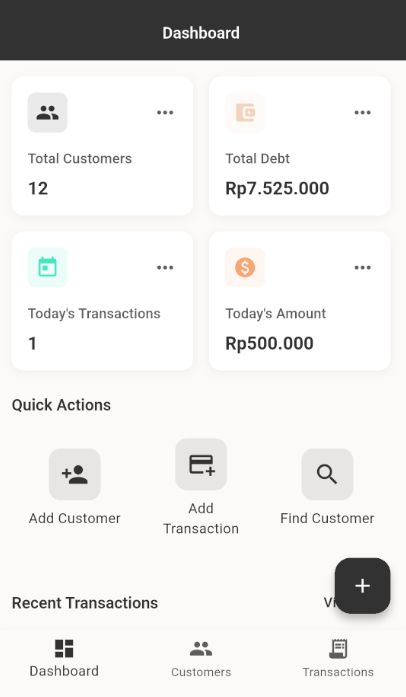

# Aplikasi Pencatatan Transaksi Pelanggan

Aplikasi Flutter untuk mengelola dan melacak transaksi pelanggan dan catatan utang. Dirancang untuk pedagang atau pengusaha kecil yang perlu mencatat transaksi kredit secara efisien.

## 👥 Kelola Data Pelanggan dengan Mudah

- Simpan info lengkap pelanggan: nama, nomor WA, alamat, plus total utangnya
- Total utang otomatis keupdate tiap ada transaksi baru - gak perlu hitung manual!
- Cari data pelanggan cepat pakai nama/nomor HP - praktis pas lagi buru-buru

## 📊 Catat Transaksi Cepat & Praktis

- Transaksi Utang: Pas pelanggan minjem barang/nambah utang, tinggal input sekali klik
- Transaksi Bayar: Begitu pelanggan melunasi, langsung kurangi sisa utang otomatis
- Lengkap dengan detail: nominal, deskripsi transaksi ("Beli 5kg Beras"), dan tanggalnya